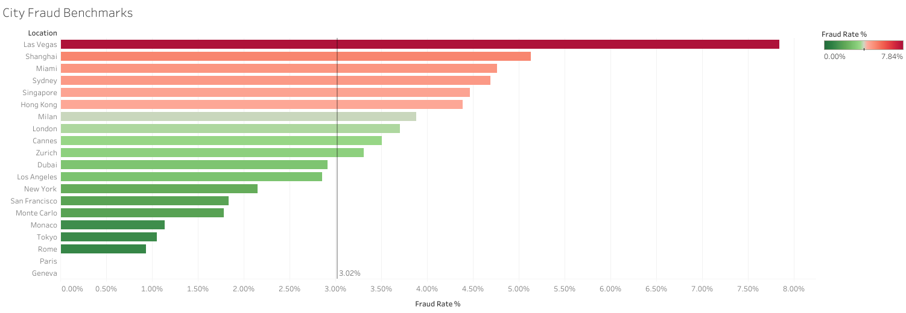

# Retail & E-Commerce Fraud Risk Analytics & Monitoring

---

## Overview

This project analyzes a portfolio of **2,133 global e-commerce and retail transactions** to identify fraud patterns, measure economic loss exposure, and evaluate automated monitoring strategies.

The objective is to approach the dataset from a **Fraud Risk & Operations Monitoring perspective**:

* Monitor portfolio-level fraud KPIs and dollar loss exposure
* Identify geographic hubs and loyalty tiers with elevated fraud risk
* Analyze the economic concentration of fraud losses across product lines and devices
* Evaluate temporal velocity patterns to detect automated script testing
* Translate BigQuery SQL queries into an interactive Tableau monitoring dashboard

The project uses **SQL (Google BigQuery)** for data validation, aggregation, and segmentation, with **Tableau Public** used for executive reporting and visual monitoring.

---

## Business Questions

The analysis focuses on several practical risk-monitoring questions:

1. What is the overall fraud profile and total economic loss of the transaction portfolio?
2. Is fraud disproportionately concentrated in particular geographic regions or loyalty tiers?
3. Are there temporal velocity patterns associated with elevated fraud activity?
4. What data ingestion and demographic tracking gaps exist across checkout gateways?
5. What monitoring rules and step-up authentication thresholds should be implemented to mitigate losses?

---

## Dataset

The analysis utilizes transactional data covering multi-channel customer purchases across 20 global metropolitan markets.

The dataset contains:
* **2,133 transactions**
* `Transaction_ID` — Unique transaction identifier
* `Customer_ID` — Unique customer profile identifier
* `Transaction_Time` — Timestamp of checkout execution
* `Purchase_Amount` — Gross transaction value ($ USD)
* `Product_Category` — Retail merchandise classification
* `Location` — Purchasing metropolitan gateway
* `Device_Type` — Device used for checkout (`Desktop`, `Laptop`, `Mobile`, `Tablet`)
* `Customer_Loyalty_Tier` — Account loyalty classification (`Bronze`, `Silver`, `Gold`, `Platinum`, `VIP`)
* `Fraud_Flag` — Target fraud indicator (`0 = Genuine`, `1 = Fraud`)

The raw dataset is stored in Google BigQuery and processed through structured SQL scripts.

---

## Data Quality

Before performing the analysis, SQL validation checks were used to assess:

* Portfolio size and unique entity counts
* Schema formatting and temporal data types
* Target binary encoding verification (`Fraud_Flag IN (0, 1)`)
* Missing values in customer demographic fields

**Audit Result:** Identified **106 records with missing demographic values** (`Customer_Age IS NULL`), primarily concentrated in processing gateways for Tokyo (10.53% missing) and Monaco (9.09% missing).

---

## Executive Portfolio KPIs

| KPI | Result |
| :--- | :--- |
| **Total Transactions** | 2,133 |
| **Fraud Transactions** | 66 |
| **Fraud Rate (Count)** | 3.09% |
| **Total Transaction Volume** | $372,451.82 |
| **Total Fraud Loss Amount** | $11,005.65 |
| **Economic Fraud Loss Rate** | 2.95% |
| **Average Transaction Amount** | $174.61 |
| **Average Sales Amount** | $166.75 |

---

## Key Risk Findings

### 1. Geographic Risk Concentration
* **Las Vegas** represents the highest-risk market with a **7.84% fraud rate** (more than 2.5x the portfolio average), followed by APAC regional nodes including **Shanghai (5.13%)**, **Sydney (4.69%)**, and **Singapore (4.46%)**.
* Low-risk baseline regions include **Paris (0.00%)**, **Geneva (0.00%)**, and **Rome (0.93%)**.

### 2. Loyalty Tier & Account Takeover (ATO) Vulnerability
* While **Bronze accounts** generate the highest raw fraud volume (24 cases), **VIP tiers exhibit an elevated fraud rate of 5.41%**, indicating targeted credential stuffing and high-value account takeover behavior.

### 3. Temporal Velocity Surges
* Off-peak overnight hours demonstrate sharp fraud surges, peaking at **4:00 AM (7.95% fraud rate)** and **Midnight (5.88%)**, contrasting with daytime baselines (~1.16%–3.85%).

---

## Monitoring Dashboard

> 



---

## SQL Queries

<details>
<summary><b>1. Data Quality & Baseline KPI Audit</b> (Click to expand)</summary>

```sql
SELECT 
  COUNT(*) AS total_transactions,
  COUNT(DISTINCT Customer_ID) AS unique_customers,
  SUM(Fraud_Flag) AS total_fraud_cases,
  COUNTIF(Customer_Age IS NULL) AS missing_age_count,
  ROUND(SUM(Fraud_Flag) * 100.0 / COUNT(*), 2) AS overall_fraud_rate_pct,
  ROUND(SUM(Purchase_Amount), 2) AS total_portfolio_volume,
  ROUND(SUM(CASE WHEN Fraud_Flag = 1 THEN Purchase_Amount ELSE 0 END), 2) AS total_fraud_loss
FROM `fraud_analysis.fraud_records`;
